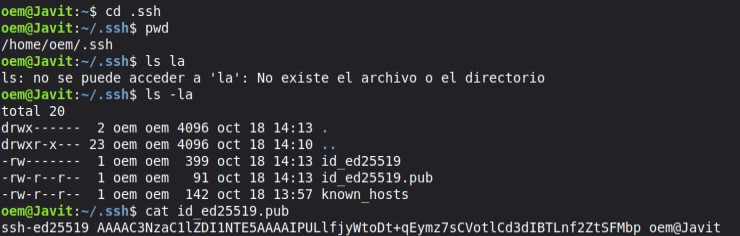

# UT1-A3 Practicando Git

***Nombre:*** Javier
 
***Curso:*** 1ºDAM 
___
### ÍNDICE

+ [Introducción](#id1)
+ [Objetivos](#id2)
+ [Material empleado](#id3)
+ [Desarrollo](#id4)
+ [Preguntas](#id5)
+ [Conclusiones](#id6)

___
#### ***Introducción***. 

Esta práctica muestra el uso básico de Git mediante la creación de un repositorio, gestión de ramas,
uso de tags, resolución de conflictos y configuración de archivos ignorados.
___
#### ***Objetivos***. 

Los objetivos que buscamos son practicar con Git y la terminal.
___
#### ***Material empleado***. 

En esta práctica para realizarla se ha empleado una cuenta en github, acceso a internet, una maquina virtual con 
el sistema operativo linux, un editor de texto como "nano" o "vi",ficheros y carpetas creadas en el proceso,
ramas, tags,comandos,etc.... 
___
#### ***Desarrollo***. 

Primero saco la clave ssh ya que no habia trabajado antes en esta maquina y la pegue en github.

Seguidamente cloné el repositorio de "my-proyecto" y el de "etsdam_javier"
añadí el archivo README.md en el repositorio de etsdam_javier.

Hecho todo eso creé el fichero que pedía llamado privado.txt y una carpeta llamada privada las cuales después había que añadirlas al fichero .gitignore y aparecen en el repositorio.

Después había que crear otro fichero llamado 1.txt en el que pornerle "Hola".

Segudamente crear otra rama y poner "adios" en el mismo fichero lo que dio un conflicto ya después solucionado con unos comandos.

Después te pedía el listado de ramas:

Y finalmente te pedia que eliminaras la rama:

___
> ***IMPORTANTE:*** si estamos capturando una terminal no hace falta capturar todo el escritorio y es importante que se vea el nombre de usuario.

En esta práctica he tenido varios problemas pero los he solucionado como por ejemplo que puse el archivo README.md en una carpeta que no iba y lo tuve que quitar usando el comando "rm -r 'archivo'"
y moviendolo a la otra carpeta correspondiente con el comando "mv~/'ubicacion'". 

___
#### ***Preguntas***. 

1. Respuesta: Cuando clonas un repositorio, Git ya configura automáticamente el repositorio remoto y la rama que estás siguiendo, por lo que al hacer "git push" no necesitas usar "origin master".
2. Respuesta: Si el fichero privado.txt y el directorio privada están correctamente especificados en el fichero .gitignore, Git los ignorará.
3. Respuesta: La accion de "git add" mueve los cambios realizados en los ficheros de tu area de trabajo al area de preparación. Por otro lado el "git commit" coge todos los ficheros que están en el area de preparación y los pasa al repositorio.
4. Respuesta: Un tag en un repositorio es una etiqueta que se utiliza para marcar un punto específico en la historia del repositorio como importante.
5. Respuesta: Las ramas permiten el desarrollo aislado y simultáneo de características o correcciones. Esto es importante para la colaboración en equipos de cualquier tamaño, desde pequeños hasta grandes, manteniendo la estabilidad del código y facilitando la gestión de múltiples líneas de trabajo.
6. Respuesta: No, ya que los conflictos solo ocurren si las dos ramas modificaron las mismas líneas de código; si trabajaron en lugares distintos, no habrá problema.
___
#### ***Conclusiones***. 

En esta práctica me ha ayudado a practicar y recordar comandos lo que me va a facilitar la asignatura mucho más y aunque haya tenido poco tiempo para hacer esta práctica creo que me ha servido mucho. 
