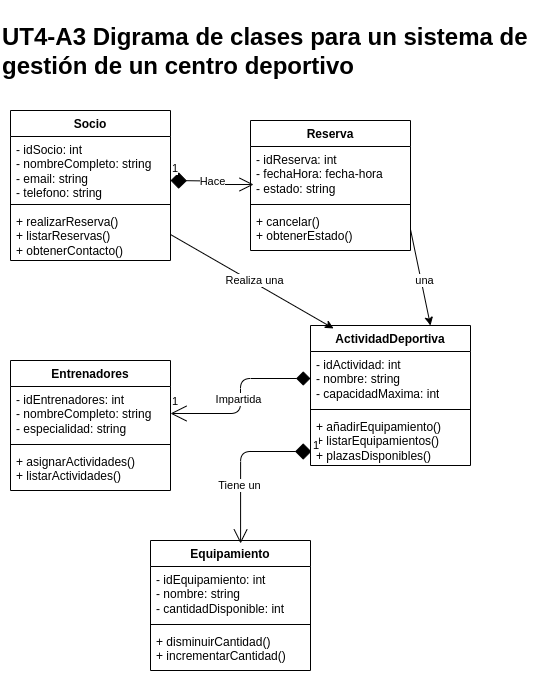

# UT4-A3 Sistema de gestión de centro deportivo

El Centro Deportivo **“SportPlus”** necesita modelar su sistema interno de gestión de **socios**, **entrenadores**, **actividades deportivas** y **reservas**. El objetivo es construir un **diagrama de clases UML**   basado únicamente en la información especificada a continuación.  

> 🚨 El modelo final debe contener exclusivamente aquello que aparece escrito y debe respetar todas las relaciones, cardinalidades y atributos indicados.

En el centro se gestionan **socios** registrados que participan en actividades. Cada **socio** dispone de los atributos:

- `idSocio` (int)
- `nombreCompleto` (string)
- `email` (string)
- `telefono` (string)

Cada Socio puede apuntarse a diferentes **actividades deportivas**, como yoga, spinning o pilates. Las **actividades deportivas** deben registrar:

- `idActividad` (int)
- `nombre` (string)
- `capacidadMaxima` (int)

Las Actividades son impartidas por **entrenadores**, cada uno con:

- `idEntrenador` (int)
- `nombreCompleto` (string)
- `especialidad` (string)

Un Entrenador puede impartir varias Actividades, pero cada Actividad es impartida por un único Entrenador.

Los Socios pueden realizar **reservas** de plaza en una Actividad concreta. Cada **reserva** contiene:

- `idReserva` (int)
- `fechaHora` (fecha-hora)
- `estado` (string)

Cada **reserva** está asociada a un único **socio** y una única **actividad deportiva**. Un **socio** puede tener muchas **reservas**, y una **actividad deportiva** puede tener muchas **reservas**.

En algunos casos una **actividad deportiva** puede disponer de **equipamiento** especializado:

- `idEquipamiento` (int)
- `nombre` (string)
- `cantidadDisponible` (int)

Cada **actividad deportiva** puede tener cero, uno o varios **equipamientos** asociados. Cada **equipamiento** pertenece exclusivamente a una única **actividad deportiva**.

> El diagrama final deberá incluir únicamente las clases mencionadas (Propietario, Animal, Veterinario, Consulta, Tratamiento, Medicacion), con todos los atributos indicados y las relaciones y cardinalidades exactas.

Para cada una de las clases se deben implementar los siguientes **métodos**:

- #### Socio
    - `realizarReserva()`
    - `listarReservas()`
    - `obtenerContacto()`

- #### ActividadDeportiva
    - `añadirEquipamiento()`
    - `listarEquipamientos()`
    - `plazasDisponibles():`

- #### Entrenador
    - `asignarActividad()`   
    - `listarActividades()`

- #### Reserva
    - `cancelar(): void`
    - `obtenerEstado(): string`

- #### Equipamiento
    - `disminuirCantidad()`
    - `incrementarCantidad()`

A continuación se muestra el **diagrama de clases** realiazado:

