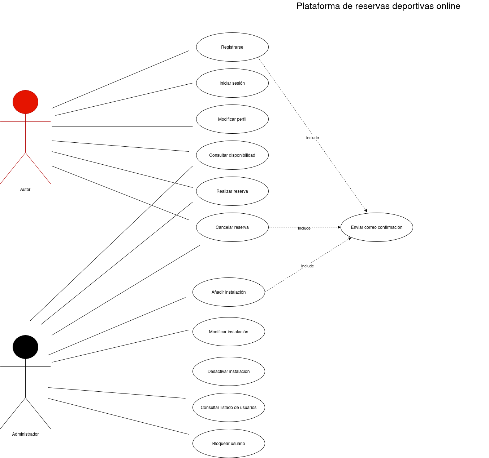

Una empresa quiere desarrollar un sistema para gestionar una **plataforma de reservas online** de instalaciones deportivas municipales (pistas de pádel, pistas polideportivas, piscinas, salas de musculación, etc.). La plataforma permitirá a los ciudadanos registrarse, consultar disponibilidad y realizar reservas, mientras que los administradores podrán gestionar instalaciones, horarios y usuarios.

- Lee detenidamente el siguiente texto descriptivo:
    - Los ciudadanos deben poder registrarse en la plataforma, iniciar sesión y modificar su perfil.
    - Los usuarios registrados pueden consultar la disponibilidad de una instalación para un día y franja horaria concreta.
    - Si la instalación está disponible, el usuario puede realizar una reserva.
    - Un usuario puede cancelar una reserva con al menos 24 horas de antelación.
    - El administrador del sistema puede añadir nuevas instalaciones deportivas, modificar sus datos o desactivarlas temporalmente.
    - El Administrador también puede consultar un listado de usuarios y bloquear a aquellos que incumplan las normas de uso.
    - El sistema envía un correo electrónico de confirmación cuando la reserva se realiza correctamente.

- Identifica y representa en la tabla:
    - Todos los actores del sistema.
    - Todos los casos de uso principales.
    - Las posibles relaciones include y extend que consideres necesarias.

| ACTOR | DESCRIPCION DEL ACTOR | CASOS DE USO DEL ACTOR |
|:-----:|:---------------------:|:----------------------:|
|    Ciudadano   |  Usuario registrado en la plataforma                     |   Registrarse, iniciar sesión, Realizar reserva, Cancelar reserva, modificar perfil, consultar disponibilidad                    |
|       |                       |                        |
    |                       |                        |

Elabora un diagrama de casos de uso UML empleando la herramienta de modelado que estés utilizando (StarUML, draw.io). 

