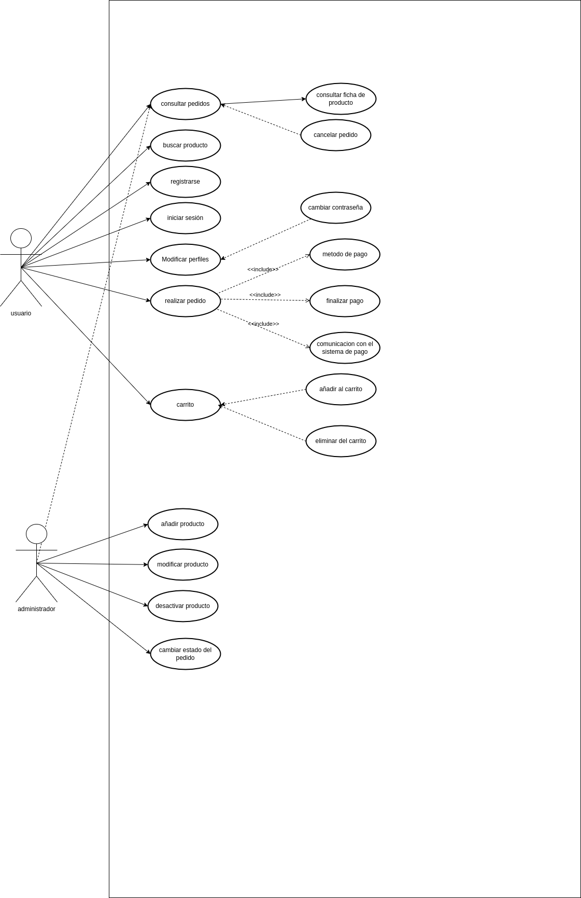

# UT5-A3 Diagrama de casos de uso de un sistema de compra online

## Enunciado

Una tienda online desea modelar, mediante un diagrama de casos de uso, el funcionamiento de su sistema de compras.

La plataforma permite que los usuarios:

- Registrarse
- Iniciar sesión
- Modificar perfil
- Buscar producto
- Consultar ficha de producto
- Añadir producto al carrito
- Eliminar producto del carrito
- Realizar pedido.
  - Es necesario que:
    - Se elija el método de pago
    - Se finalice el pago
    - Se produzca una comunicación con el sistema de pago.
  - Opcionalmente:
    - Recibir confirmación ( el envío del correo ocurre sólo cuando el pago es correcto)
    - Modificar el perfil para cambiar la contraseña sólo se activa si el usuario lo solicita.
    - Al consultar un pedido podrá cancelarse sólo si el pedido permanece en estado pendiente
- Seleccionar método de pago
- Finalizar pago
- Recibir confirmación
- Consultar pedidos
- Cancelar pedido (solo si el pedido aún no ha sido enviado)

La plataforma permite al admininstrador:

- Añadir producto
- Modificar producto
- Desactivar producto
- Consultar pedidos
- Cambiar estado del pedido

 La actividad consiste en:

1. Identificar los actores que intervienen en el sistema.
2. Identificar los casos de uso principales.
3. Definir las relaciones include/extend cuando sea necesario.
4. Especificar extension points cuando proceda.
5. Realizar un diagrama textual UML (no gráfico) que represente el sistema.
6. Explicar brevemente por qué existen esas relaciones. 

